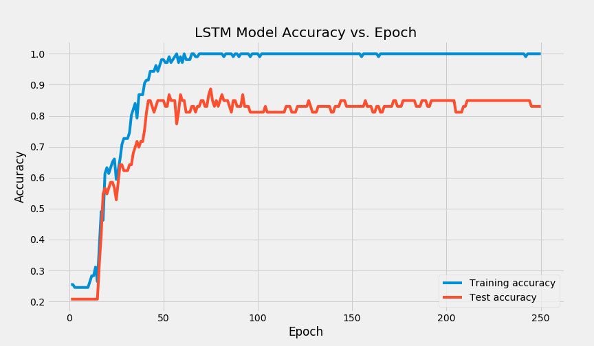

# The Natural Language Processing of Chronic Illness Survey Questions
### First place submission for UCSD DataHacks 2020
### Team Name: Beeg Data
### Team Members: [Tanveer Mittal](https://github.com/TanveerMittal) & [Ayush More](https://github.com/ayushmore)

# Table of Contents:
 1. [Data Cleaning &amp; Pre-processing](#i-data-cleaning--pre-processing)

 2. [Data Visualization](#ii-data-visualization)
 3. [Modeling &amp; Analysis](#iii-modeling--analysis)
 4. [Conclusion](#iv-conclusion)

# I. Data Cleaning & Pre-processing:
* **NLP Visualizations**: To visualize the questions in this dataset, we cleaned the data by only keeping each unique question and its corresponding topic label. Since this section of our analysis was done on the natural language in the dataset we only needed these 2 fields for the 203 unique questions in our dataset to build a corpus.

* **LSTM Classification**: Similar to the preparation for the NLP section above, we built a corpus to analyze by using only the unique questions in the dataset and their corresponding topic labels. After this, we looked at the distribution of topics in this corpus. We noticed that many of the topics in our corpus had 10 or fewer questions in our corpus so far. Deep learning models usually require a lot of data to learn intuitions about the structure of natural language and for this reason, we decided that there was little benefit in attempting to classify underrepresented topics in our corpus. If we had kept all these questions then our model would most likely have overfit on those limited questions. After this, our corpus was reduced to the 8 largest topics in our dataset. Finally, to prepare the data for modeling, we used the Tensorflow tokenizer object to define our corpus’s vocabulary and to convert each word to an appropriate index representation. After that, we applied the len function built-in to python using pandas to find the length of the longest sentence to pad our input sequences to a fixed length. We then converted the topic labels to indices and split the data into a training and test set.

* **Permutation Testing**: Our permutation testing focused on the topic of tobacco, specifically the proportion of underage smokeless tobacco users and the proportion of underage cigarette users, and questioned the effectiveness of how strict a state is in terms of requiring a retail license to sell tobacco products as well as the local tobacco control and prevention laws. Before starting the process of permutation testing, we were made aware of the year when these surveys were conducted and worked with data only relating to the specified year, which was 2015. After understanding the data, we noticed an absence of information about these topics from 19 states and territories, in which they were represented as null values. We chose to exclude these states out of our testing due to lack of information, and as a result, decreased our population size in both categories of states with strong policies on retail licenses and prevention laws. Additionally, the quantitative datasets (proportion of youth using cigarettes/smokeless tobacco) contained a cumulative national proportion (labeled United States) that we excluded because our focus is on the individual states and territories. After the pre-processing and cleaning, we were left with a clean dataset of the remaining 35 states and territories and the proportions of cigarette youth users and smokeless tobacco users, allowing us to continue with permutation testing. This procedure was replicated for our other permutation tests because the states that were missing values were consistent throughout the four datasets.

# II. Data Visualization:
* **Tableau Dashboard Links**:
  * [Word Clouds](https://public.tableau.com/profile/ayush.more#!/vizhome/DataHacksWordClouds/WordClouds)

  * [T-SNE Projections(Cumulative)](https://public.tableau.com/profile/ayush.more#!/vizhome/T-SNEPROJECTIONSCumulative/Dashboard2)
  * [T-SNE Projections of TF-IDF Features](https://public.tableau.com/profile/ayush.more#!/vizhome/TF-IDFT-SNEPROJECTIONS/T-SNETF-IDF)
  * [T-SNE Projections of GloVe Embeddings](https://public.tableau.com/profile/ayush.more#!/vizhome/GloVeT-SNEPROJECTIONS/T-SNEGloVe)
  * [T-SNE Projections of Word2Vec Embeddings](https://public.tableau.com/profile/ayush.more#!/vizhome/Word2vecT-SNEPROJECTIONS/T-SNEWord2vec)

* Tips for using the dashboards:
  * Hover over points to see what survey questions and topics they correspond to

  * Select topics on the scatter plots to highlight points belonging to that topic
    * Observe how our methods were able to capture the similarity of the natural language used in survey questions regarding cancer or nutrition questions specifically about high school students

  * Select different topics to see the corresponding word clouds

  

  

* **Methodology**: To visualize the natural language content of this dataset’s survey questions, we wanted to apply transformations to these questions to project them onto a 2-dimensional space. The first step towards achieving these visualizations was to extract meaningful features from the text to turn our unstructured text into structured data. We used 3 methods for this: Global Vectors for Word Representation(GloVe), Word2Vec embeddings, and Term Frequency-Inverse Document Frequency(TF-IDF). We used the SpaCy module to convert each word into a 300-dimensional word2vec embedding. We then downloaded pre-trained GloVe embeddings and loaded them into python as a dictionary that would convert each word into a 300-dimensional numpy vector. For both of these methods, we simply took the mean of each word’s embedding in a survey question to produce a 300-dimensional embedding that represents the content of that question. We also used the sklearn module to create a sparse TF-IDF matrix for our corpus.

  &nbsp;&nbsp;&nbsp;&nbsp;&nbsp;&nbsp;Once we had these 3 different methods of extracting structured data from our corpus, we needed to visualize them and we cannot achieve that if our data is in 300 dimensions or in a sparse TF-IDF matrix. To transform this high dimensional data into 2-dimensional data we decided to explore unsupervised machine learning approaches. We tried the following dimension reduction algorithms in the sklearn module: Principal Component Analysis(PCA), Negative Matrix Factorization(NMF), Singular Value Decomposition(SVD) and T-distributed Stochastic Neighbor Embedding(T-SNE). When visualizing most of these methods it was difficult to see any logical divisions or clusterings of the questions by topic, except for when we applied T-SNE. In our T-SNE plots, we could clearly see how our feature extraction methods were able to capture the similarity in content for questions of the same topic and content. We then saved this 2-dimensional data as CSV files to be imported into Tableau for creating the dashboards we have linked above.

  &nbsp;&nbsp;&nbsp;&nbsp;&nbsp;&nbsp;While working on the 2d scatter plots described above, we noticed that we could extract words from our TF-IDF matrix with the highest weights for each processed question. From this, we thought about visualizing our TF-IDF processing using bar plots or pie charts for each word’s relevance to a question and/or topic. Eventually, we came up with the idea of creating a word cloud using Tableau. To do this, we created and applied a function to our data frame to extract keywords and their corresponding TF-IDF weights from each question. After this, we grouped the dataframe by topic and applied a function to sum up the TF-IDF scores for each word. Finally, we exported the questions, topics, keywords, and scores to a CSV file to create the word cloud dashboard in Tableau.

# III. Modeling & Analysis:
* **LSTM Classification**: Originally we planned on only classifying the survey questions by applying the unsupervised KMeans clustering algorithm to the dimensionally reduced data. After trying an exhaustive grid search for this method, we decided to stop pursuing this approach. Our inertia values were too large and we could not achieve a homogeneity score over 50% on the clustering task. We believe this mostly due to a combination of class imbalance, which makes it harder for KMeans to identify topics with few questions as distinct clusters, and a lack of training data.

  &nbsp;&nbsp;&nbsp;&nbsp;&nbsp;&nbsp;After this, we decided to create a recurrent deep learning model to process each question and classify it by topic. We chose a Long Short-Term Memory(LSTM) model with a dense layer using the softmax activation function. We chose the LSTM over the traditional RNN because it is less prone to the vanishing and exploding gradient problems due to the more sophisticated gate calculations. We also used the Tensorflow embedding layer so that our model could convert the index representation of our input question to our own custom 100-dimensional word embeddings which are learned through the training process.

	&nbsp;&nbsp;&nbsp;&nbsp;&nbsp;&nbsp;After training our model for the first time, we noticed that the model was drastically overfitting to our training set. Our training set accuracy was exactly 100% while our test set accuracy was <60%. To solve this issue, we implemented a variety of techniques. The first thing we did was implement L2 regularization on the softmax dense layer. L2 regularization penalizes larger weights during the training process and because of this our model did not learn to improperly skew the softmax probability distribution that our model outputs. After that, we also applied dropout on our LSTM cell so that our model learns not to rely too heavily on certain features of the cell states from previous timesteps and the word embeddings. To collect further data, we wrote a custom Tensorflow callback that would evaluate our model on the test set after each epoch and store them in a list. This allowed us to then plot the training accuracies and test accuracies as the model was training.

  

  &nbsp;&nbsp;&nbsp;&nbsp;&nbsp;&nbsp;After seeing this plot, we decided to extend the functionality of this custom callback, by storing the maximum test accuracy achieved during and the corresponding weights that achieved that performance. As you can see below, our callback was able to successfully save the best parameters.

  

* **Permutation Testing**: We conducted four permutation tests related to states with strong policies on retail licenses for tobacco and states with strong tobacco control and prevention laws to see the effects of these two measures on the proportion of youth that smokes cigarettes and the proportion of youth that uses smokeless tobacco. Listed below are the null hypotheses for our tests:

  1. States with strict policies that require retail license laws to sell tobacco have the same proportion of current underage smokeless tobacco users as those states without the strong policies.

  2. States with strict policies that require retail license laws to sell tobacco have the same proportion of current underage cigarette users as those states without the strong policies.

  3. States that allow stronger local tobacco control and prevention laws have the same proportion of current underage smokeless tobacco users as those states without the stronger control and laws.

  4. States that allow stronger local tobacco control and prevention laws have the same proportion of current underage cigarette users as those states without the stronger control and laws

  &nbsp;&nbsp;&nbsp;&nbsp;&nbsp;&nbsp;The test statistic we measured was the difference in the mean proportion between “No” and “Yes”. For instance, if the null hypothesis we were testing was on stronger tobacco control and the current underage cigarette user, then our test statistic would be the difference of proportion of youth cigarette users in states that do not have strong tobacco control and the proportion of youth cigarette users in states that do have a strong tobacco control. In order to test this statistic, we shuffled the columns of qualitative variables (tobacco control, retail license policies) amongst the proportions and calculated the mean proportion of the quantitative variable (cigarette users, smokeless tobacco users). We then repeated this simulation 1000 times and plotted the distribution of the mean proportions from shuffling and compared it to our observed population test statistic. Listed below is a visualization created using matplotlib for the null hypothesis: *States with strict policies that require retail license laws to sell tobacco have the same proportion of current underage smokeless tobacco users as those states without the strong policies*.

  

  &nbsp;&nbsp;&nbsp;&nbsp;&nbsp;&nbsp;Our observed population test statistic was 0.176, which was obtained from the difference of mean proportions from states without strong policies and states with strong policies relative to underage smokeless tobacco users. Given the distribution of the 1000 simulations, we observed that 43.4% of the simulated shuffled mean proportions were above our observed population test statistic. This also represents our p-value, and because it is not significant (we define our significance level at 5%), we conclude that we fail to reject the null hypothesis. Below are the distributions for the other null hypotheses and the p-value associated with it:

  2. States with strict policies that require retail license laws to sell tobacco have the same proportion of current underage cigarette users as those states without the strong policies.
    * P-Value: 0.430

    

  3. States that allow stronger local tobacco control and prevention laws have the same proportion of current underage smokeless tobacco users as those states without the stronger control and laws.
    * P-Value: 0.363

    

  4. States that allow stronger local tobacco control and prevention laws have the same proportion of current underage cigarette users as those states without the stronger control and laws
    * P-Value: 0.154

    

    By defining our significance level at 5%, we fail to reject all four of our null hypotheses.

# IV. Conclusion:
* **LSTM Classification**: There were only 203 unique questions we could classify from this dataset. While our model performed well on the data given to us, we had an extremely limited training set, especially after splitting it into a test set as well. Due to this limitation if our model is tested on data outside of this dataset we might not perform nearly as well due to overfitting. Upon further inspection, the reason our model made wrong predictions on our test set, was that certain questions in our test set had words that our model never encountered during training. Due to this our model never learned an embedding representation for some words in the vocab. Due to this problem, our model would further struggle on questions that include words that are outside of the model’s trained vocabulary. If we had further time as well, we would have used the custom word embeddings we trained with our LSTM model to create another visualization of our corpus in Tableau.

* **Permutation Testing**: After conducting our four permutation tests via shuffling the qualitative variables (yes/no) against the quantitative variables (proportions), we failed to reject all four of the null hypotheses. Although we failed to reject the null hypotheses, we cannot confirm that they are true. The tests we conducted failed to reject the null hypothesis, but this does not mean that other tests fail to reject the same null hypotheses. While conducting these permutation tests, we made the assumption that states with a stricter policy on tobacco licenses/strong tobacco prevention control and laws would correlate to the decreased proportion of cigarette youth smokers and smokeless tobacco users. We could improve our tests by gathering more data on the states that did not participate in this survey to capture a more holistic view of the nation.

  &nbsp;&nbsp;&nbsp;&nbsp;&nbsp;&nbsp;Furthermore, it would also be helpful to understand the types of areas these surveys were conducted within the states, such as rural/suburban/urban areas because the lifestyles between these places vary and thus could influence an individual’s choice to use tobacco. The data that we worked with only specified the state and did not reveal the exact location or county that these surveys were conducted, which would qualify the representation of the state from the surveys (ex. Bakersfield is not a full representation of California). Additionally, we worked with survey data from 2015, which predated the advent of smokeless tobacco devices such as JUULs. We would expect the proportion of current (2019/2020) cigarette youth smokers to decrease in exchange for a significantly larger increase in smokeless tobacco youth users because of the accessibility and advertisements of these devices as safer alternatives to smoking. Additionally, in response to these new devices, we would also expect more states to incorporate stricter policies on the retail license on tobacco products and enforce stronger tobacco prevention laws due to the popularity and unawareness of the harmful health effects from the devices. This would influence our permutation tests and could potentially allow us to reject the null hypotheses against more current data.
